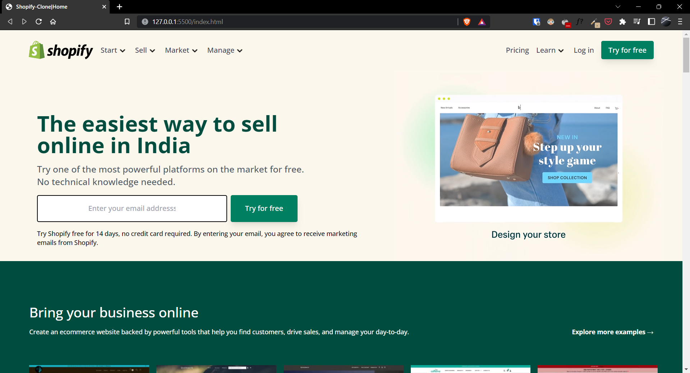
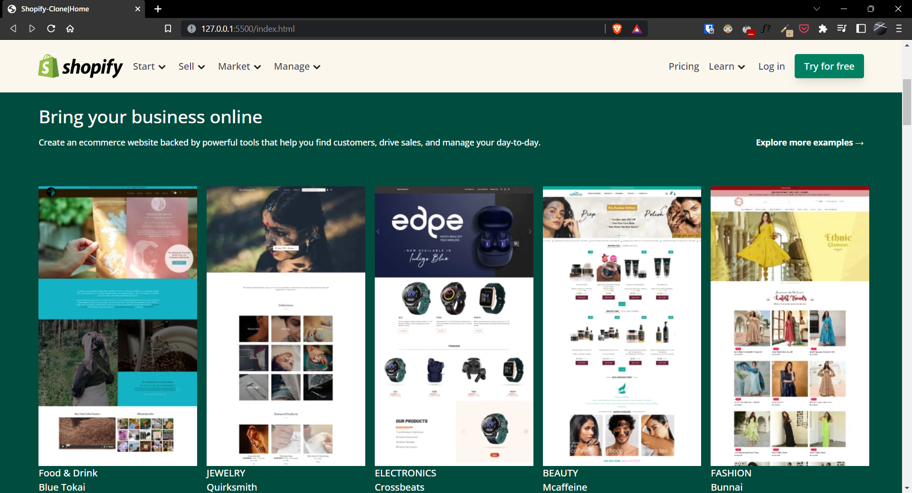
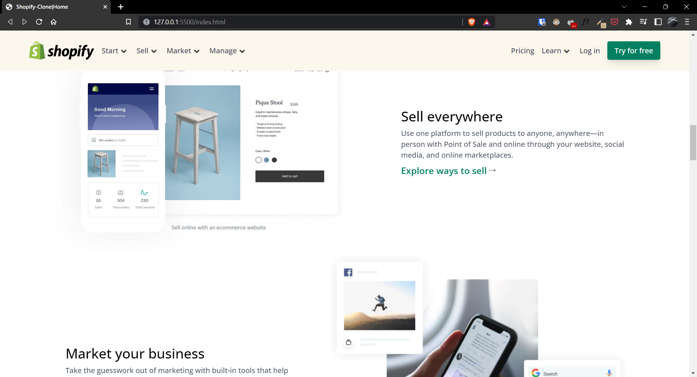
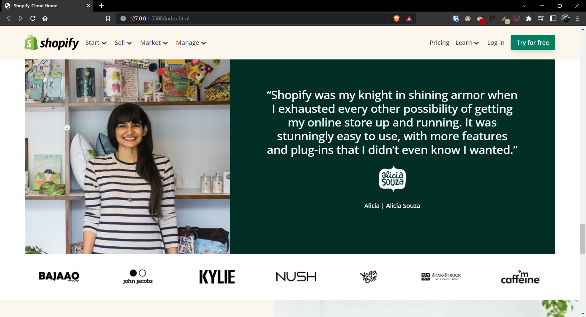
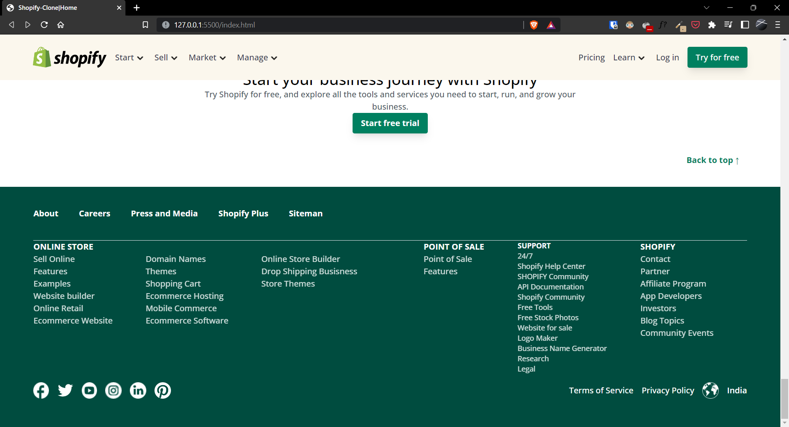

# Project-16 | Shopify Clone

Hi there,
I'm Wasit Ali and this is my 16th project and 2nd project in HTML and Tailwind CSS.

## 🖥 Preview

🚀 [Live Preview](https://coruscating-cat-82de84.netlify.app/)

## 🛠️ What I have learned in this project?

- More about Tailwind and its use case.
- Handled mobile responsive entirely with Tailwind CSS.

## ⏲ Time taken to finish the project

- It took me 3-4 days.
